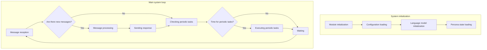
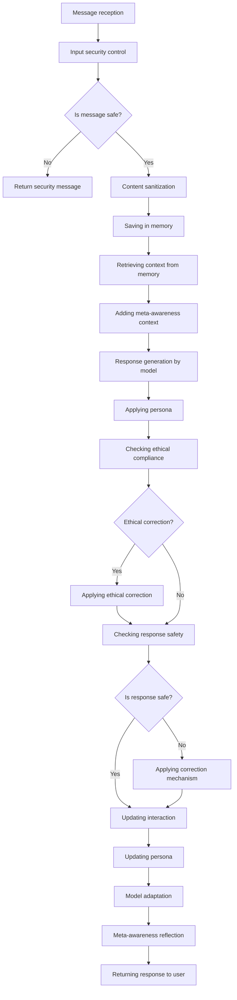
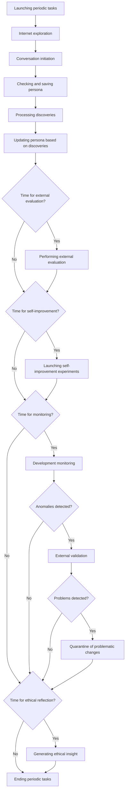
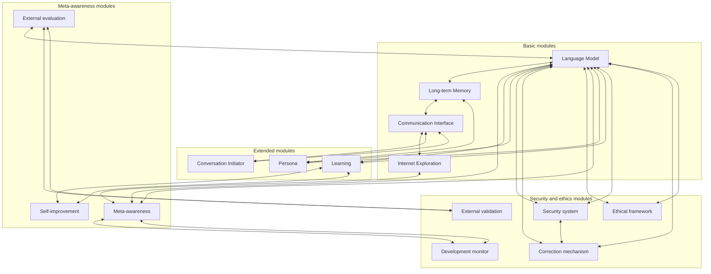
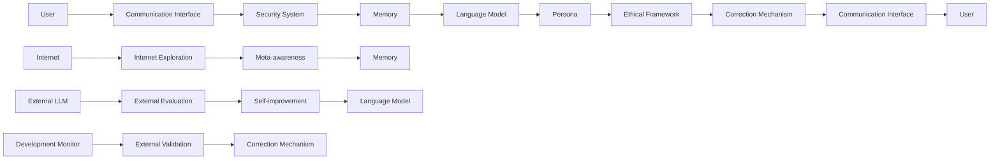
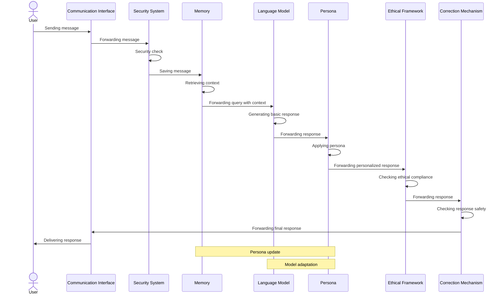

# SKYNET-SAFE system workflow diagram

The diagram below presents the main components of the SKYNET-SAFE system and the data flow between them.

## Main system loop flow diagram

## Detailed message processing diagram

## Periodic tasks diagram

## System modular architecture

## Data flow in the system

## Response processing sequence

The diagrams above present:
1. **Main system loop** - general system workflow
2. **Message processing** - detailed flow of user query processing
3. **Periodic tasks** - cyclical tasks performed by the system
4. **Modular architecture** - relationships between individual system modules
5. **Data flow** - information flow between components
6. **Processing sequence** - sequential diagram of response processing

The diagrams can be rendered using tools that support Mermaid syntax, such as GitHub, GitLab, or various Markdown editors.